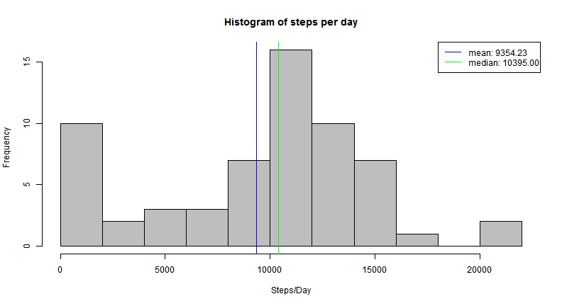
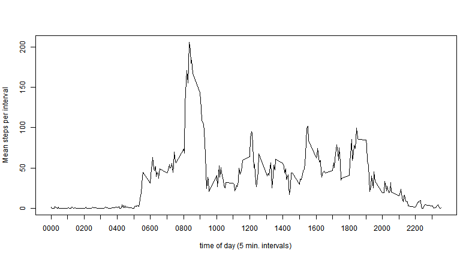
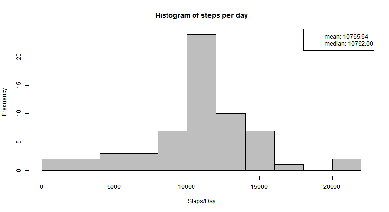
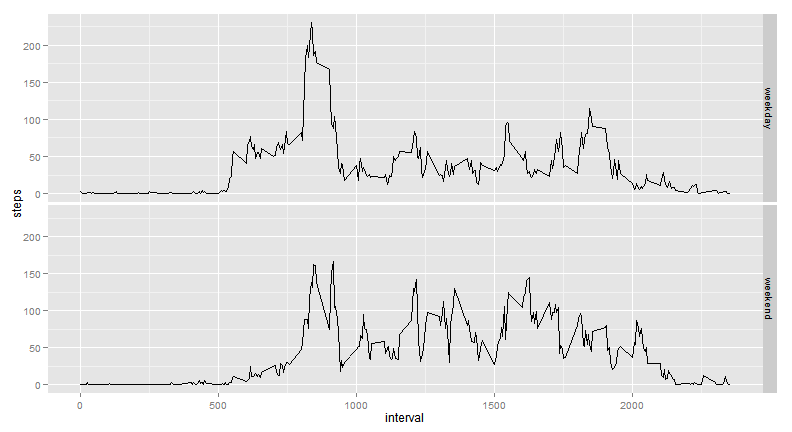

# Reproducible Research: Peer Assessment 1


## Loading and preprocessing the data


```r
# read input data
movement <- read.csv("activity.csv")
# the last row is all NA; let's delete rows with NA date
```


There are a total of 17,568 observations in this dataset.

The variables included in this dataset are:
- steps: Number of steps taking in a 5-minute interval (missing values are coded as NA)
- date: The date on which the measurement was taken in YYYY-MM-DD format
- interval: Identifier for the 5-minute interval in which measurement was taken


## What is mean total number of steps taken per day?


```r
steps.perday <- aggregate(movement$steps, by= list(movement$date), sum, na.rm=T) 

# find mean and median of steps per day
mean.steps.perday   <- mean  (steps.perday$x)
median.steps.perday <- median(steps.perday$x)

mean.str   <- formatC(mean.steps.perday  , format="f", digits=2)
median.str <- formatC(median.steps.perday, format="f", digits=2)

hist(steps.perday$x, breaks=10, main="Histogram of steps per day", xlab="Steps/Day", col="gray")

abline(v= mean.steps.perday  , col="blue" ) # mean   vertical line
abline(v= median.steps.perday, col="green") # median vertical line

legend("topright", legend=c(paste("mean:", mean.str), paste("median:", median.str)), lty=1, col=c("blue", "green") )
```

 


- Mean steps per day: 9354.23 
- Median steps per day: 10395.00


## What is the average daily activity pattern?


```r
mean.steps.perinterval <- aggregate(movement$steps, by= list(movement$interval), mean, na.rm=T) 

plot(mean.steps.perinterval$Group.1, mean.steps.perinterval$x, type="l", xlab="time of day (5 min. intervals)", ylab="Mean steps per interval", xaxt="n")

axis(1, at=seq(0,2300,100), labels=sprintf("%04d", seq(0,2300,100)))
```

 


```r
# find the 5-minute interval with the highest average number of steps
maxinterval           <- which.max(mean.steps.perinterval$x) # index of max
maxinterval.time.str  <- sprintf("%04d", mean.steps.perinterval[maxinterval,]$Group.1)
maxinterval.steps.str <- sprintf("%.1f", mean.steps.perinterval[maxinterval,]$x      )
```


- Time of interval with highest average number of steps: 0835 
- Mean number of steps for this interval: 206.2


## Imputing missing values


```r
# number of missing values
movement.na.count <- sum(is.na(movement$steps))
```


- Total number of missing values: 2304


We'll create a copy of movement, and replace all of the missing values in the dataset by the *round* of the mean steps for that time interval.


```r
movement2 <- movement
for (idx in 1:nrow(movement2))
		if (is.na(movement2$steps[idx]))
		{
			interval             <- movement2$interval[idx]                         # interval 
			interval.idx         <- match(interval, mean.steps.perinterval$Group.1) # idx of interval in mean.steps.perinterval
			movement2$steps[idx] <- round(mean.steps.perinterval$x[interval.idx])   # replace with round of mean value
		}
```


We'll now explore if after replacing NAs - the mean and median steps per day are different


```r
# aggregate by interval, and calculate mean
steps.perday <- aggregate(movement2$steps, by= list(movement2$date), sum, na.rm=T) 

# find mean and median of steps per day
mean.steps.perday   <- mean  (steps.perday$x)
median.steps.perday <- median(steps.perday$x)

mean.str   <- formatC(mean.steps.perday  , format="f", digits=2)
median.str <- formatC(median.steps.perday, format="f", digits=2)

hist(steps.perday$x, breaks=10, main="Histogram of steps per day", xlab="Steps/Day", col="gray")

abline(v= mean.steps.perday  , col="blue" ) # mean   vertical line
abline(v= median.steps.perday, col="green") # median vertical line

legend("topright", legend=c(paste("mean:", mean.str), paste("median:", median.str)), lty=1, col=c("blue", "green") )
```

 


- Mean steps per day: 10765.64 
- Median steps per day: 10762.00

We can see that the general shape of the histogram is similar.  
We can also see that mean and media steps per day are bit higher, and the frequency of days with 0 steps is much lower.

## Are there differences in activity patterns between weekdays and weekends?

We create a new factor variable in movement2  with two levels - "weekday" and "weekend" indicating whether a given date is a weekday or weekend day.

We use as.POSIXlt() instead of weekdays(), since the result of weekdays() depends on the lcoale (see http://stackoverflow.com/questions/17031002/get-weekdays-in-english-in-rstudio)


```r
weekend   <-  c(0,6) # 0: Sunday up to 6: Saturday. weekends in most Western countries are Sunday and Saturday
movement2 <- cbind(movement2, ifelse(is.element(as.POSIXlt(movement2$date)$wday, weekend), "weekend", "weekday"))
colnames(movement2)[4] <- "daytype"
```


And now we'll plot the daily activity pattern for weekdays and weekends:


```r
library(ggplot2)

# aggregate by interval and day type, and calculate mean
mean.steps.perinterval <- aggregate(movement2$steps, by= list(movement2$interval, movement2$daytype), mean) 
colnames(mean.steps.perinterval) <- c("interval", "daytype", "steps")

ggplot(mean.steps.perinterval, aes(interval, steps)) + geom_line()+ facet_grid(daytype ~ .)
```

 

